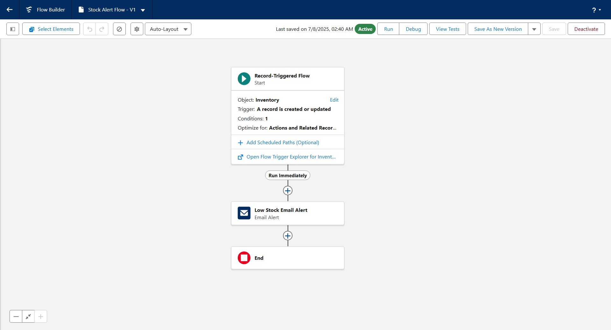

# HandsMen Threads - Salesforce Data Management & Automation Project

## 👤 Project Owner
**Name**: Nishu Kumar  
**Email**: [nishukumarsahu9752@gmail.com](mailto:nishukumarsahu9752@gmail.com)

---

## 🧵 Project Overview

**HandsMen Threads**, a forward-thinking fashion industry brand, is launching a Salesforce-based digital transformation project. This initiative is focused on enhancing data management, improving customer relationships, and optimizing internal operations through powerful automation and seamless integration of business workflows.

---

## 🎯 Use Case Summary

The project aims to:

- Build a **robust custom data model** for storing business-critical information.
- Ensure **data integrity directly from the Salesforce UI**.
- Automate and streamline several customer and inventory processes.

### Key Business Automations:

- **📧 Automated Order Confirmations**: Customers receive real-time email notifications after placing orders, enhancing engagement.
- **🏅 Dynamic Loyalty Program**: Loyalty status (`Gold`, `Silver`, `Bronze`) updates based on purchase history to drive customer retention.
- **🚨 Proactive Stock Alerts**: Alerts warehouse teams via email when stock quantity falls below 5 units.
- **🕛 Scheduled Bulk Order Updates**: Daily at midnight, the system updates bulk orders, financial data, and inventory levels automatically.

---

## 📚 What You'll Learn

- **Data Modelling in Salesforce**
- **Maintaining Data Quality**
- **Using Lightning App Builder**
- **Designing Record-Triggered Flows**
- **Apex Programming & Apex Triggers**
- **Asynchronous Apex (Batch Apex, Scheduled Jobs)**

---

## 🛠️ Skills Required

- Salesforce Development  
- Salesforce Apex  
- Salesforce Lightning Components & Flows  

---

## 🧩 Project Structure

### 📌 Epics
- **Total Epics**: 16

### 📌 Stories & Tasks
- **Total Stories**: 35  
- **Total Subtasks**: 0

---

## 🧪 System Requirements

### ✅ Supported Browsers
- Google Chrome (Recommended)
- Mozilla Firefox
- Microsoft Edge
- Safari (Mac only)
- Internet Explorer 11 (Limited Support)

> **Note**: At least **2 browsers** should be installed.

### 💻 OS Compatibility
- Windows 8/10/11
- macOS (Latest versions)
- Linux (Browser-dependent support)
- ChromeOS (via browser)

### 📽️ Demo Video

Watch the full demo of the Salesforce CRM automation project in action:

▶️ [Click to Watch Video on Google Drive](https://drive.google.com/file/d/1e_k5bHQpoqNDwhM9eMexBTxOgCZN5i9i/view?usp=drive_link)

### 💾 Hardware Requirements
| Component     | Minimum Requirement | Recommended          |
|---------------|---------------------|----------------------|
| Processor     | Intel Core i3       | Intel Core i5/i7     |
| RAM           | 4 GB                | 8 GB or more         |
| Storage       | 10 GB Free Disk     | SSD for better speed |
| Display       | 1366 x 768          | 1920 x 1080          |

### 🌐 Network
- Stable broadband connection (≥30 Mbps)
- Ensure **no VPN restrictions** that block Salesforce access

---

## 🧑‍💼 Mentorship

No mentor assigned yet.

---

## ✅ Final Remarks

This Salesforce project will help HandsMen Threads move toward **data-driven decision-making**, **automated operations**, and a **personalized customer experience**. It provides practical, hands-on exposure to real-world Salesforce tools and automation strategies, preparing you for advanced Salesforce development roles.

---
